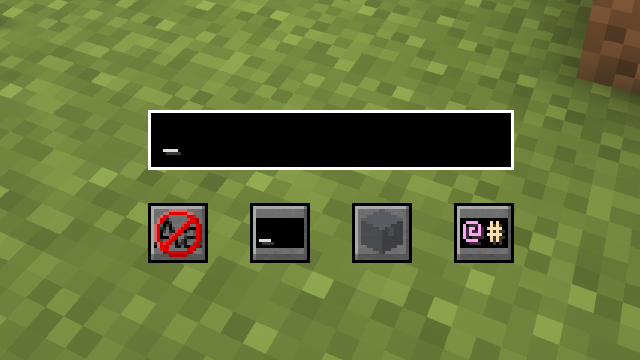

# Regex Search
Search for items in the world. You can search by name, mod, id, tags and tooltips.

Highlights matching items in the world so you can easily find them.

## Features
### Different search modes
- Regex: Search using regular expressions
- Extended: Search using extended notation, see below
- Literal: Search with normal text
### Highlight items
- Items matching your query gets highlighted
- Can be seen through walls
- Show what kind of container the item lies in
### Search options
- Search in blocks, entities, or both
- Match or ignore letter case
## How to use
Open search screen using `Y` (configurable)

Press enter to search

Clear search field to remove highlights

Use up/down arrows for search history

Here you can select
1. Whether to match or ignore letter case
2. If your last search will be remembered
3. Search in blocks, entities, or both
4. Select search mode

### Extended notation
Extended notation allows you to specify which attribute to match by using different prefixes.
- `@mod` Matches all items from the mod `mod`
- `*id` Matches all items whose item id contains `id`
- `$tag` Matches the item's tags
- `#tooltip` Matches the item's tooltip
- `name` Matches the item's name
- `-negate` Matches everything that does not match `negate` 
- `^word` Matches items whose attribute starts with `word`
- `word$` Matches items whose attribute ends with `word`

#### Examples
`@minecraft`
Matches everything from minecraft. Also matches items from `minecraft2` `not_minecraft` etc.

`*^redstone`
Matches items whose id starts with `redstone`

`-#a`
Matches all items whose tooltip does not contain the letter `a`

`^sword$`
Matches only items whose name is exactly `sword`

## Server-side config
- `int range` Search range in all directions
- `int recursionLimit` How many levels of nesting to search, -1 for no limit
- `int maxInventories` Max number of containers to return, -1 for no limit
- `int maxSearchResults` Total number of items to return, -1 for no limit
- `int maxSearchResultsPerInventory` -1 for no limit